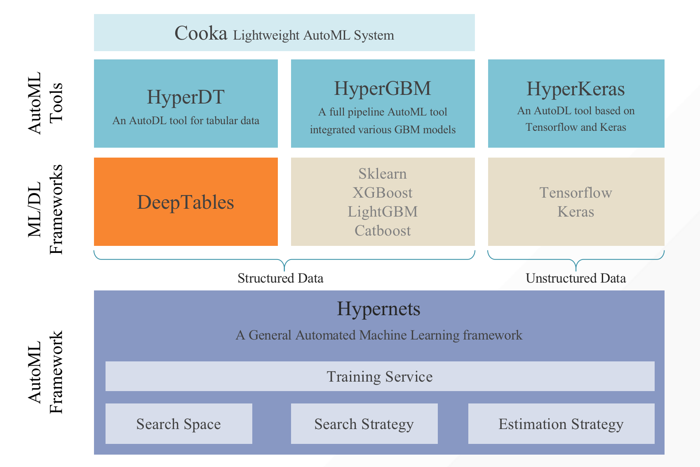

# HyperGBM
[](https://pypi.org/project/hypergbm)
[](https://pepy.tech/project/hypergbm)
[](https://pypi.org/project/hypergbm)

[Doc](https://hypergbm.readthedocs.io/en/latest/) | [中文](https://hypergbm.readthedocs.io/zh_CN/latest/)

## We Are Hiring！
Dear folks,we are offering challenging opportunities located in Beijing for both professionals and students who are keen on AutoML/NAS. Come be a part of DataCanvas! Please send your CV to yangjian@zetyun.com. (Application deadline: TBD.)  

## What is HyperGBM
HyperGBM is a full pipeline automated machine learning (AutoML) toolkit designed for tabular data. It covers the complete end-to-end ML processing stages, consisting of data cleaning, preprocessing, feature generation and selection, model selection and hyperparameter optimization.

## Overview 

HyperGBM optimizes the end-to-end ML processing stages within one search space, which differs from most existing AutoML approaches that only tackle partial stages, for instance, hyperparameter optimazation. This full pipeline optimization process is very similar to a sequential decision process (SDP). Therefore, HyperGBM utilizes reinforcement learning, Monte Carlo Tree Search, evolution algorithm combined with a meta-learner to efficiently solve the pipeline optimization problem.  

HyperGBM, as indicated in the name, involves several gradient boosting tree models (GBM), namely, XGBoost, LightGBM and Catboost. What's more, it could access the [Hypernets](https://github.com/DataCanvasIO/Hypernets), a general automated machine learning framework, and introduce its advanced characteristics in data cleaning, feature engineering and model ensemble. Additionally, the search space representation and search algorithm inside Hyper GBM are also supported by Hypernets.


## Tutorial
* [Quick Start](https://hypergbm.readthedocs.io/en/latest/quick_start.html)
* [Examples](https://hypergbm.readthedocs.io/en/latest/example.html)
* [CompeteExperiment](https://hypergbm.readthedocs.io/en/latest/compete_experiment.html)
* [HyperGBM](https://hypergbm.readthedocs.io/en/latest/hypergbm.html)
* [Searchers](https://hypergbm.readthedocs.io/en/latest/searchers.html)

## Installation

Install HyperGBM with different options:

* Typical installation:
```bash
pip install hypergbm
```

* To run HyperGBM in JupyterLab/Jupyter notebook, install with command:
```bash
pip install hypergbm[notebook]
```

* To support dataset with simplified Chinese in feature generation,
  * Install `jieba` package before running HyperGBM. 
  * OR install with command:
```bash
pip install hypergbm[zhcn]
```

* Install all above with one command:
```bash
pip install hypergbm[all]
```

## Examples

* Use HyperGBM with Python

Users can quickly create and run an experiment with `make_experiment`, which only needs one required input parameter `train_data`. The example shown below is using the `blood` dataset as `train_data` from `hypernet.tabular`. If the target column of the dataset is not `y`, it needs to be manually set through the argument `target`. 

An example codes:
```python
from hypergbm import make_experiment
from hypernets.tabular.datasets import dsutils

train_data = dsutils.load_blood()
experiment = make_experiment(train_data, target='Class')
estimator = experiment.run()
print(estimator)
```

This training experiment returns a pipeline with two default steps, `data_clean` and `estimator`. In particular, the `estimator` returns a final model which consists of various models. The outputs：
```
Pipeline(steps=[('data_clean',
                 DataCleanStep(...),
                ('estimator',
                 GreedyEnsemble(...)])
``` 
To see more examples, please read [Quick Start](https://hypergbm.readthedocs.io/en/latest/quick_start_python.html#create-experiment-with-make-experiment) and [Examples](https://hypergbm.readthedocs.io/en/latest/example.html).


* Use HyperGBM with Command line tools

Hypergbm also supports command line tools to perform model training, evaluation and prediction. The following codes enable the user to view command line help:
```
hypergbm -h

usage: hypergbm [-h] [--log-level LOG_LEVEL] [-error] [-warn] [-info] [-debug]
                [--verbose VERBOSE] [-v] [--enable-dask ENABLE_DASK] [-dask]
                [--overload OVERLOAD]
                {train,evaluate,predict} ...
```

The example of training a model for dataset [blood.csv](https://github.com/DataCanvasIO/Hypernets/blob/master/hypernets/tabular/datasets/blood.csv) is shown below:
```shell script
hypergbm train --train-file=blood.csv --target=Class --model-file=model.pkl
```
For more details, please read [Quick Start](https://hypergbm.readthedocs.io/en/latest/quick_start_cmdline.html).

## Hypernets related projects
* [Hypernets](https://github.com/DataCanvasIO/Hypernets): A general automated machine learning (AutoML) framework.
* [HyperGBM](https://github.com/DataCanvasIO/HyperGBM): A full pipeline AutoML tool integrated various GBM models.
* [HyperDT/DeepTables](https://github.com/DataCanvasIO/DeepTables): An AutoDL tool for tabular data.
* [HyperKeras](https://github.com/DataCanvasIO/HyperKeras): An AutoDL tool for Neural Architecture Search and Hyperparameter Optimization on Tensorflow and Keras.
* [Cooka](https://github.com/DataCanvasIO/Cooka): Lightweight interactive AutoML system.



## Documents

* [Overview](https://hypergbm.readthedocs.io/en/latest/overview.html)
* [Installation](https://hypergbm.readthedocs.io/en/latest/overview.html)
* [Quick Start](https://hypergbm.readthedocs.io/en/latest/quick_start.html)
* [Examples](https://hypergbm.readthedocs.io/en/latest/example.html)
* [How-To](https://hypergbm.readthedocs.io/en/latest/how_to.html)
* [Release Notes](https://hypergbm.readthedocs.io/en/latest/release_note.html)

## DataCanvas
HyperGBM is an open source project created by [DataCanvas](https://www.datacanvas.com/). 
