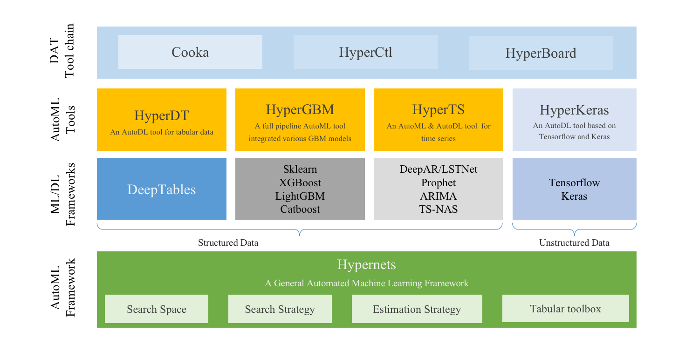

# HyperGBM
[](https://pypi.org/project/hypergbm)
[](https://pepy.tech/project/hypergbm)
[](https://pypi.org/project/hypergbm)

[English](README.md)

## HyperGBM是什么？
HyperGBM是一款全Pipeline自动机器学习工具，可以端到端的完整覆盖从数据清洗、预处理、特征加工和筛选以及模型选择和超参数优化的全过程，是一个真正的结构化数据AutoML工具包。

## 概览 
大部分的自动机器学习工具主要解决的是算法的超参数优化问题，而HyperGBM是将从数据清洗到算法优化整个的过程放入同一个搜索空间中统一优化。这种端到端的优化过程更接近于SDP(Sequential Decision Process)场景，因此HyperGBM采用了强化学习、蒙特卡洛树搜索等算法并且结合一个meta-leaner来更加高效的解决全Pipeline优化的问题，并且取得了非常出色的效果。

正如名字中的含义，HyperGBM中的机器学习算法使用了目前最流行的几种GBM算法（更准确的说是梯度提升树模型），目前包括XGBoost、LightGBM和Catboos。HyperGBM中的优化算法和搜索空间表示技术由 [Hypernets](https://github.com/DataCanvasIO/Hypernets) 项目提供支撑。同时HyeprGBM复用了Hypernets提供的许多高级建模特性，如数据漂移检测、特征生成、特征筛选、伪标签、模型融合等。

## 安装

### Conda

可以从 *conda-forge* 安装HyperGBM:

```bash
conda install -c conda-forge hypergbm
```

对于Windows系统, 安装HyperGBM时建议将pyarrow(hypernets的依赖)的版本限制在4.0或更早:

```bash
conda install -c conda-forge hypergbm "pyarrow<=4.0"
```

### Pip

基本的，使用如下`pip`命令安装HyperGBM:
```bash
pip install hypergbm
```

可选的, 如果您希望在JupyterLab中使用HyperGBM, 可通过如下命令安装HyperGBM:
```bash
pip install hypergbm[notebook]
```
可选的,  如果您希望在特征衍生时支持中文字符中, 可通过如下命令安装HyperGBM:
```bash
pip install hypergbm[zhcn]
```
可选的, 如果您希望使用基于Web的实验可视化，可通过如下命令安装HyperGBM:
```bash
pip install hypergbm[board]
```

可选的, 可通过如下命令安装HyperGBM所有组件及依赖包:
```bash
pip install hypergbm[all]
```

如果您要使用GPU对HyperGBM进行加速的话，还需要在运行HyperGBM之前安装NVIDIA RAPIDS中的cuML和cuDF，RAPIDS的安装方法请参考 [https://rapids.ai/start.html#get-rapids](https://rapids.ai/start.html#get-rapids)

## 示例

* 通过Python使用HyperGBM

用户可以利用HyperGBM提供的 `make_experiment` 工具快速创建一个实验，该工具由许多选项，但只有 `train_data`这一个参数是必须的，该参数指定用于训练的数据集。如果数据集的目标列不是‘y'的话，需要通过参数 `target` 指定。

下面示例中利用Hypernets内置的数据集创建一个实验并训练得到模型：

```python
from hypergbm import make_experiment
from hypernets.tabular.datasets import dsutils

train_data = dsutils.load_blood()
experiment = make_experiment(train_data, target='Class')
estimator = experiment.run()
print(estimator)
```

在使用默认配置的情况下，训练所得的模型是一个包含`data_clean` and `estimator`的Pipeline，需要注意的是Pipeline中 `estimator` 是一个融合模型：

```
Pipeline(steps=[('data_clean',
                 DataCleanStep(...),
                ('estimator',
                 GreedyEnsemble(...)])
```

更多使用示例请参考 [Quick Start](https://hypergbm.readthedocs.io/zn_CN/latest/quick_start_python.html#create-experiment-with-make-experiment) and [Examples](https://hypergbm.readthedocs.io/zh_CN/latest/example.html).


* 通过命令行使用HyperGBM

HyperGBM提供了无需编程的命令行工具`hypergbm`，该工具支持模型训练、评估和预测，详细信息可参考该工具的帮助信息:

```
hypergbm -h

usage: hypergbm [-h] [--log-level LOG_LEVEL] [-error] [-warn] [-info] [-debug]
                [--verbose VERBOSE] [-v] [--enable-gpu ENABLE_GPU] [-gpu] 
                [--enable-dask ENABLE_DASK] [-dask] [--overload OVERLOAD]
                {train,evaluate,predict} ...

hypergbm train -h
usage: hypergbm [-h] --train-data TRAIN_DATA [--eval-data EVAL_DATA] [--test-data TEST_DATA]
			    [--target TARGET] [--task {binary,multiclass,regression}]
			    [--max-trials MAX_TRIALS] [--reward-metric METRIC] ...                
```

假设您的训练数据文件是 [blood.csv](https://github.com/DataCanvasIO/Hypernets/blob/master/hypernets/tabular/datasets/blood.csv) ，可通过如下命令进行模型训练：

```shell script
hypergbm train --train-file=blood.csv --target=Class --model-file=model.pkl
```

更多使用示例请参考 [Quick Start](https://hypergbm.readthedocs.io/zh_CN/latest/quick_start_cmdline.html).

## GPU 加速

值得强调的是，HyperGBM还支持全Pipeline的GPU加速，包括所有的数据处理和模型训练环节，在我们的实验环境中可得到最多超过50倍的性能提升 ！更重要的是，使用GPU训练的模型可以部署到没有GPU硬件和软件（CUDA）的环境中，大大降低模型上线的成本。


## 相关文章

* [HyperGBM用4记组合拳提升AutoML模型泛化能力](https://zhuanlan.zhihu.com/p/349824150)
* [HyperGBM用Adversarial Validation解决数据漂移问题](https://zhuanlan.zhihu.com/p/349432455)
* [HyperGBM的三种Early Stopping方式](https://zhuanlan.zhihu.com/p/350051541)
* [如何HyperGBM解决分类样本不均衡问题](https://zhuanlan.zhihu.com/p/350052055)
* [HyperGBM轻松实现Pseudo-labeling半监督学习](https://zhuanlan.zhihu.com/p/355419632)

## Hypernets 相关项目
 
* [Hypernets](https://github.com/DataCanvasIO/Hypernets): 一个通用的自动机器学习框架.
* [HyperGBM](https://github.com/DataCanvasIO/HyperGBM): 一个集成了多个GBM模型的全Pipeline AutoML工具.
* [HyperDT/DeepTables](https://github.com/DataCanvasIO/DeepTables): 一个面向结构化数据的AutoDL工具.
* [HyperTS](https://github.com/DataCanvasIO/HyperTS): 一个面向时间序列数据的AutoML和AutoDL工具.
* [HyperKeras](https://github.com/DataCanvasIO/HyperKeras): 一个为Tensorflow和Keras提供神经架构搜索和超参数优化的AutoDL工具.
* [HyperBoard](https://github.com/DataCanvasIO/HyperBoard): 一个为Hypernets提供可视化界面的工具.
* [Cooka](https://github.com/DataCanvasIO/Cooka): 一个交互式的轻量级自动机器学习系统.




## 参考文档

* [概览](https://hypergbm.readthedocs.io/zh_CN/latest/overview.html)
* [安装](https://hypergbm.readthedocs.io/zh_CN/latest/installation.html)
* [快速开始](https://hypergbm.readthedocs.io/zh_CN/latest/quick_start.html)
* [使用示例](https://hypergbm.readthedocs.io/zh_CN/latest/example.html)
* [How-To](https://hypergbm.readthedocs.io/zh_CN/latest/how_to.html)
* [Release Notes](https://hypergbm.readthedocs.io/zh_CN/latest/release_note.html)

## DataCanvas
HyperGBM是由数据科学平台领导厂商 [DataCanvas](https://www.datacanvas.com/) 创建的开源项目.
